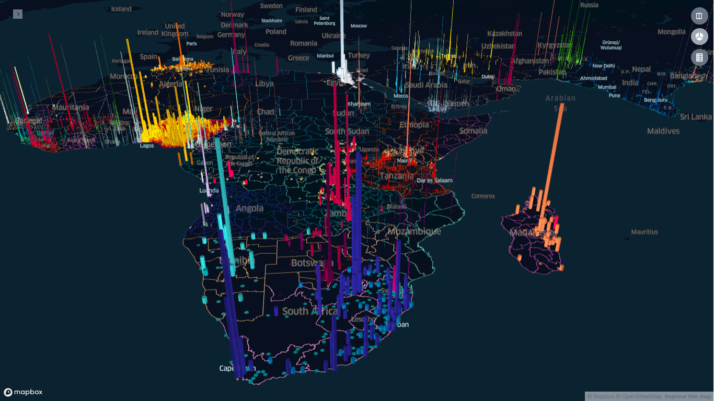

# Demo App

This project has an express backend that serves a default config.json to kepler-demo
- server runs on port 5000
- client runs on port 8080

###### Below are two sample schools from Kyrgyzstan, colored according to their level of connectivity to the internet.



### Install and run
```
cd server
yarn install
yarn start
```
- add mapbox access token to node env
```
export MapboxAccessToken=<your_mapbox_token>
```
```
cd client
yarn --ignore-engines
yarn start
```
